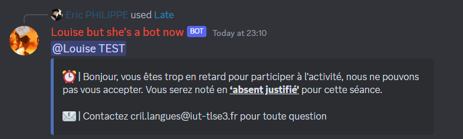

# 📀 Liste


Se référer à [menu-contextuel.md](../fundamentals/fondamentaux/menu-contextuel.md "mention") pour plus d'informations sur comment s'en servir


Late

Informe un étudiant qu'il est en retard et ne peut pas être accepté dans l'activté !

Doesn't Speak

Informe un étudiant qu'il doit participer plus activement à l'oral pour que son activité soit validée !

.png>)

Sound Problem

Informe un étudiant qu'on ne l'entend par parler et lui envoie un document pour l'aider à résoudre ses problèmes de son

.png>)

Sound Stuck

Informe un étudiant qu'il doit quitter la conversation car ses problèmes de son ne sont pas réglables rapidement et/ou simplement.

.png>)

Yeet

Déconnecte du vocal dans lequel se trouve l'utilisateur, et le timeout pendant 20 minutes lui retirant tous moyens de communiquer sur le serveur

:information\_source: L'utilisateur se retrouve timeout pour les 20 prochaines minutes, cela signifie qu'il ne peut plus rien faire sur le serveur !

:warning: Attention: Utiliser Yeet avec modération, mais n'hésitez pas en cas de problème de comportement.

